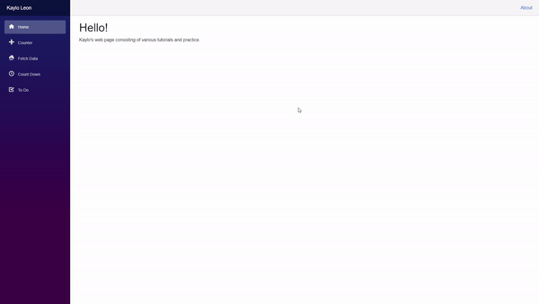

# Blazor Application

Web application consisting practice applications like a counter, weather app, and to do list. I created this website following the instructions of professor Vanselow and Microsoft tutorials provided below. This was made as an introduction to web design as well as a series of assignments for school.

# Demonstration

# Website Link

https://gray-ocean-06d632d10.azurestaticapps.net

# Built With

* Visual Studio 2019
* Blazor
* Microsoft Azure

# Author
* Kaylo Leon

Acknowledgments
* https://docs.microsoft.com/en-us/aspnet/core/tutorials/build-a-blazor-app?view=aspnetcore-5.0&pivots=server
* https://sites.google.com/site/profvanselow/programming/languages/c_1/blazor?authuser=0
* https://favicomatic.com/
